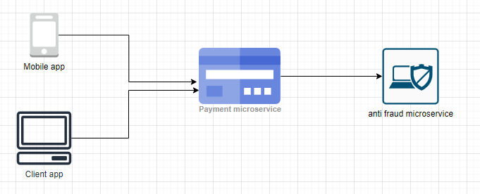

## Comparativo entre gRPC e REST em um ambiente simulado de microserviços encadeados.

Imagine o seguinte cenário: Temos um conjunto de 2 microserviços, 1 relacionado a pagamentos e outro relacionado a conferência de fraude, sendo que o primeiro sempre chama o segundo para validar os pagamentos, como pode ser visto abaixo:

  

Sendo assim, iremos coletar metricas relacionadas a uma comunicação HTTP comum do tipo REST e também de uma comnunicação HTTP utilizando gRPC, entre os serviços, na medida em que usuários simulados utilizam chamam nosso sistema.